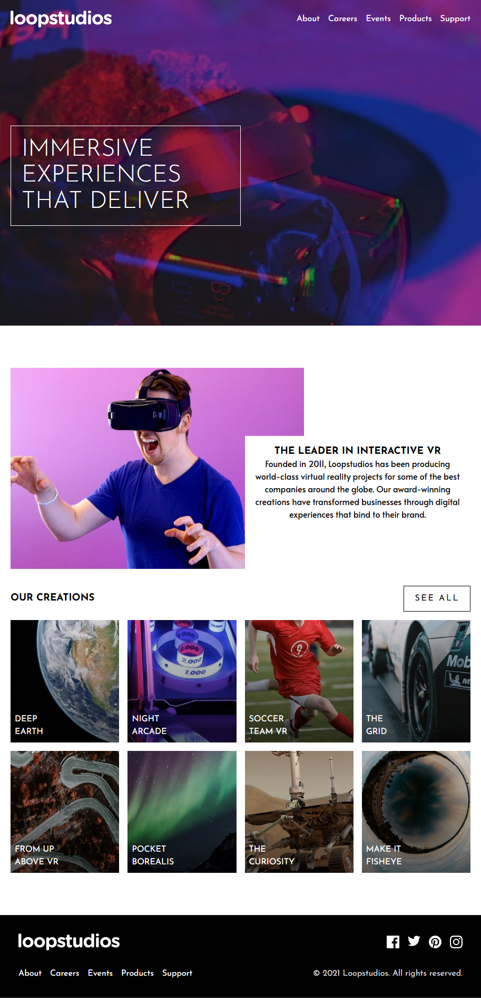

# Frontend Mentor - Loopstudios landing page solution

This is a solution to the [Loopstudios landing page challenge on Frontend Mentor](https://www.frontendmentor.io/challenges/loopstudios-landing-page-N88J5Onjw). Frontend Mentor challenges help you improve your coding skills by building realistic projects.

## Table of contents

- [Overview](#overview)
  - [The challenge](#the-challenge)
  - [Screenshot](#screenshot)
  - [Links](#links)
- [My process](#my-process)
  - [Built with](#built-with)
  - [What I learned](#what-i-learned)
  - [Continued development](#continued-development)
- [Author](#author)

## Overview

### The challenge

Users should be able to:

- View the optimal layout for the site depending on their device's screen size
- See hover states for all interactive elements on the page

### Screenshot



### Links

- Solution URL: [Add solution URL here](https://your-solution-url.com)
- Live Site URL: [Github Pages](https://temesgen-982.github.io/lupstudios-landing-page/)

## My process

### Built with

- Semantic HTML5 markup
- CSS custom properties
- Flexbox
- CSS Grid
- Mobile-first workflow
- SASS/SCSS
- CUBE CSS

### What I learned

```css
@use "../abstracts/breakpoints" as breakpoints;

$image-names: (
  "deep-earth",
  "night-arcade",
  "soccer-team",
  "grid",
  "from-above",
  "pocket-borealis",
  "curiosity",
  "fisheye"
);

.image-cards {
  --clr-gradient-top: rgba(0, 0, 0, 0.1);
  --clr-gradient-bottom: rgba(0, 0, 0, 0.6);
  div {
    background-repeat: no-repeat;
    background-size: cover;
    padding: 0.5rem;
    padding-top: 5rem;
  }
  @each $name in $image-names {
    $i: index($image-names, $name);

    div:nth-of-type(#{$i}) {
      background-image: linear-gradient(
          var(--clr-gradient-top),
          var(--clr-gradient-bottom)
        ), url(../assets/images/mobile/image-#{$name}.jpg);

      @include breakpoints.media(large) {
        background-image: linear-gradient(
            var(--clr-gradient-top),
            var(--clr-gradient-bottom)
          ), url(../assets/images/desktop/image-#{$name}.jpg);
      }
    }
  }
}
```

### Continued development

The fonts don't match exactly.

## Author

- Frontend Mentor - [@temesgen-982](https://www.frontendmentor.io/profile/temesgen-982)
- X - [@BeshowOnCode](https://x.com/BeshowOnCode)
